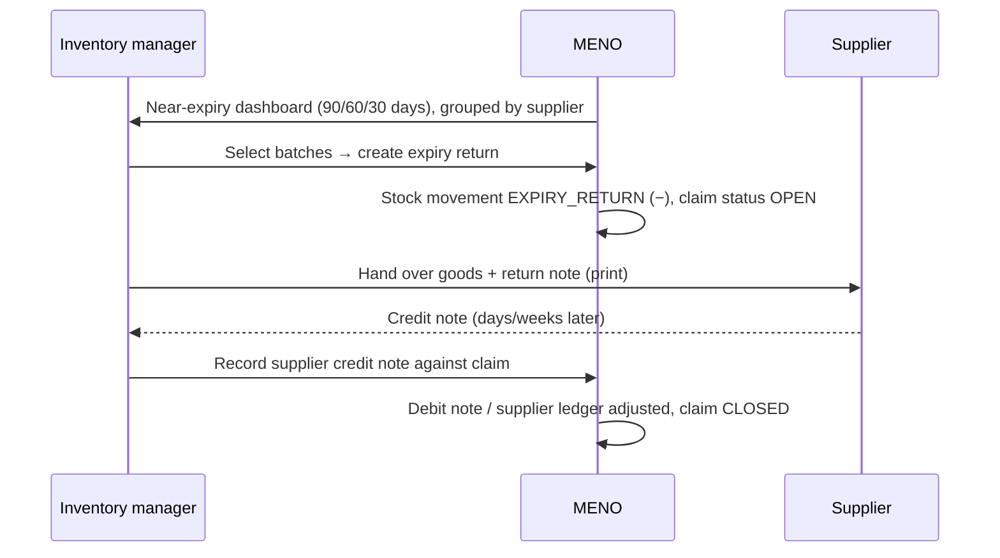

# Expiry / breakage return to supplier

```mermaid
sequenceDiagram
    participant IM as Inventory manager
    participant M as MENO
    participant S as Supplier
    M->>IM: Near-expiry dashboard (90/60/30 days), grouped by supplier
    IM->>M: Select batches → create expiry return
    M->>M: Stock movement EXPIRY_RETURN (−), claim status OPEN
    IM->>S: Hand over goods + return note (print)
    S-->>IM: Credit note (days/weeks later)
    IM->>M: Record supplier credit note against claim
    M->>M: Debit note / supplier ledger adjusted, claim CLOSED
```
