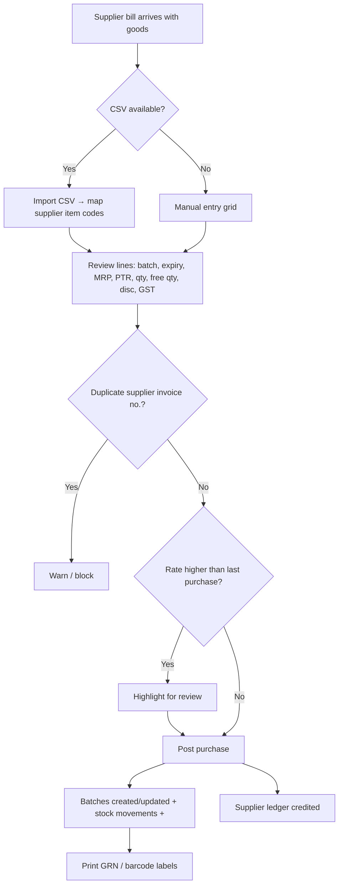

# Purchase to stock (to-be)

```mermaid
flowchart TD
    A[Supplier bill arrives with goods] --> B{CSV available?}
    B -->|Yes| C[Import CSV → map supplier item codes]
    B -->|No| D[Manual entry grid]
    C --> E[Review lines: batch, expiry, MRP, PTR, qty, free qty, disc, GST]
    D --> E
    E --> F{Duplicate supplier invoice no.?}
    F -->|Yes| G[Warn / block]
    F -->|No| H{Rate higher than last purchase?}
    H -->|Yes| I[Highlight for review] --> J
    H -->|No| J[Post purchase]
    J --> K[Batches created/updated + stock movements +]
    J --> L[Supplier ledger credited]
    K --> M[Print GRN / barcode labels]
```
