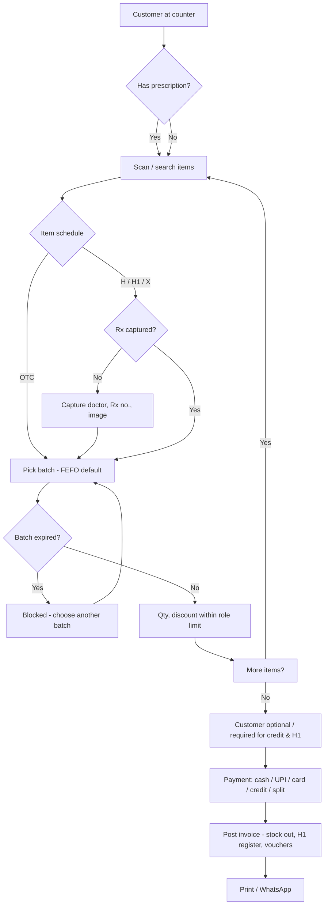

# Retail sale (to-be)

```mermaid
flowchart TD
    A[Customer at counter] --> B{Has prescription?}
    B -->|Yes| C[Scan / search items]
    B -->|No| C
    C --> D{Item schedule}
    D -->|OTC| E[Pick batch - FEFO default]
    D -->|H / H1 / X| F{Rx captured?}
    F -->|No| G[Capture doctor, Rx no., image] --> E
    F -->|Yes| E
    E --> H{Batch expired?}
    H -->|Yes| I[Blocked - choose another batch] --> E
    H -->|No| J[Qty, discount within role limit]
    J --> K[More items?]
    K -->|Yes| C
    K -->|No| L[Customer optional / required for credit & H1]
    L --> M[Payment: cash / UPI / card / credit / split]
    M --> N[Post invoice - stock out, H1 register, vouchers]
    N --> O[Print / WhatsApp]
```
