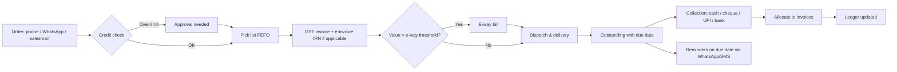

# Wholesale order to cash

```mermaid
flowchart LR
    O[Order: phone / WhatsApp / salesman] --> C{Credit check}
    C -->|Over limit| A[Approval needed] --> P
    C -->|OK| P[Pick list FEFO]
    P --> I[GST invoice + e-invoice IRN if applicable]
    I --> E{Value > e-way threshold?}
    E -->|Yes| W[E-way bill] --> D
    E -->|No| D[Dispatch & delivery]
    D --> R[Outstanding with due date]
    R --> Col[Collection: cash / cheque / UPI / bank]
    Col --> Al[Allocate to invoices] --> L[Ledger updated]
    R --> Rem[Reminders on due date via WhatsApp/SMS]
```
